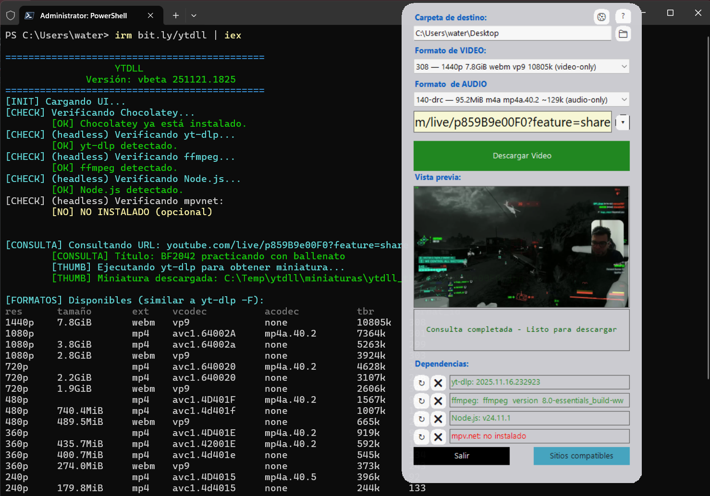
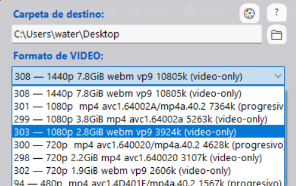
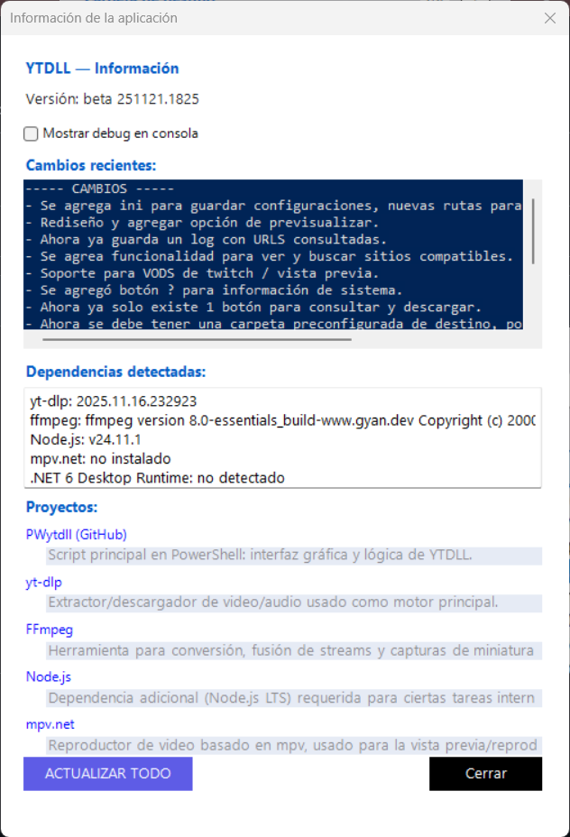

# 🎬 YTDLL – Video & Audio Downloader
Un poderoso GUI para yt-dlp hecho en PowerShell

<p align="center">
  
  
  
</p>

---

# 📖 Índice / Table of Contents
- [🌎 Descripción General](#-descripción-general--overview)
- [✨ Características](#-características--features)
  - [🔥 Principales](#-principales)
  - [🧠 Avanzadas](#-funciones-avanzadas)
- [⚙️ Requisitos](#️-requisitos-del-sistema--system-requirements)
- [🚀 Instalación](#-instalación--installation)
- [🎮 Uso](#-uso--usage)
- [📁 Estructura del Proyecto](#-estructura-del-proyecto--project-structure)
- [🖼️ Capturas de Pantalla](#️-capturas-de-pantalla--screenshots)
- [🌐 Sitios Compatibles](#-sitios-compatibles--supported-sites)
- [📄 Licencia](#-licencia--license)

---

## 🌎 Descripción General / Overview
**ES:**  
YTDLL es una aplicación gráfica moderna desarrollada en PowerShell. Combina simplicidad con potencia ofreciendo una GUI limpia e intuitiva para yt-dlp, permitiendo descargar videos y audio desde más de 1000 sitios compatibles.

**EN:**  
YTDLL is a modern GUI built in PowerShell. It provides a clean and intuitive interface for yt-dlp, enabling seamless video/audio downloads from 1000+ supported sites.

---

## ✨ Características / Features

### 🔥 Principales
- 🖼️ Vista previa en tiempo real  
- 🎯 Selección inteligente de formato (video/audio)  
- 📁 Explorador gráfico para carpeta destino  
- 🔄 Auto-instalación/actualización de dependencias (Chocolatey)  
- 📊 Progreso en tiempo real con parser avanzado  
- 🍪 Soporte de cookies  
- 📜 Historial persistente de URLs  
- 🎮 Reproducción rápida con mpv.net  
- ⚡ GUI moderna (borderless, esquinas redondeadas)

### 🧠 Funciones Avanzadas
- Detección automática de dependencias  
- Clasificación inteligente de formatos (audio-only, video-only, progressive)  
- Miniaturas desde múltiples fuentes  
- Cache local de imágenes/metadatos  
- Fallbacks inteligentes  
- Modo debug + logs detallados  
- Reintentos automáticos  
- Limpieza de temporales  

---

## ⚙️ Requisitos del Sistema / System Requirements
- Windows 10 o superior  
- PowerShell 5.1+ o PowerShell 7+  
- Internet  
- 4GB RAM recomendado  

**Dependencias manejadas automáticamente:**

- yt-dlp  
- FFmpeg  
- Node.js (LTS)  
- mpv.net (opcional)  
- Chocolatey  

---

## 🚀 Instalación / Installation

### ⭐ Método por releases (Recomendado)

1. Descarga `YTDLL.bat` desde el repositorio.
2. Ejecuta el archivo. Windows solicitará permisos de administrador.
3. El instalador consulta el último GitHub Release, descarga
   `ytdll-release.zip`, lo instala en `C:\Temp\YTDLL\app` e inicia la
   aplicación.

En las siguientes ejecuciones, el mismo BAT comprueba si existe una versión
nueva antes de abrir YTDLL.

### Método PowerShell anterior

La versión monolítica de la rama `main` todavía puede iniciarse con:

```powershell
irm bit.ly/ytdll | iex
```

El método por releases es necesario para la versión modular formada por
`Main.ps1`, `Dependencies.ps1`, `Functions.ps1` y `GUI.ps1`.

🎮 Uso / Usage
Interfaz Gráfica

Pega la URL del video

Presiona Buscar Video

Selecciona formato de video/audio

Elige carpeta destino

Clic en Descargar

Funciones Avanzadas

❓ Botón “Info”: estado de dependencias

🖼️ Click en miniatura → abre mpv

🎛️ Selector inteligente de formatos

📜 Historial desplegable

🍪 Soporte para cookies

## IA con Gemini

YTDLL permite activar un asistente IA usando Gemini Flash para ayudar a buscar videos dentro de enlaces y agregarlos a la cola de descargas.

- La API Key se guarda cifrada con DPAPI del usuario local.
- El motor tecnico de deteccion sigue siendo yt-dlp.
- Gemini clasifica y resume candidatos, pero no descarga contenido directamente.
- Los resultados siempre se muestran para seleccionarlos antes de agregarlos a la cola.

## 📁 Estructura del Proyecto / Project Structure
PWytdll/
├── Main.ps1                  # Punto de entrada
├── Dependencies.ps1          # Dependencias externas
├── Functions.ps1             # Lógica de la aplicación
├── GUI.ps1                   # Interfaz
├── Install-YTDLL.ps1         # Instalador y actualizador
├── YTDLL.bat                 # Entrada para usuarios
├── build.ps1                 # Generador del release
└── README.md

Archivos de configuración
C:\Temp\ytdll\config.ini
C:\Temp\ytdll\ytdll_history.txt
C:\Temp\ytdll\miniaturas\

## 🖼️ Capturas de Pantalla / Screenshots
🪟 Interfaz Principal



🎚️ Selector de Formatos



🧩 Información del Sistema



## 🌐 Sitios Compatibles / Supported Sites
Plataformas Principales

YouTube (videos, shorts, playlists)
Twitch (VODs, clips)
Twitter / X
TikTok
Instagram
Facebook
Reddit
Vimeo
Dailymotion

➡️ Más de 1000 sitios vía yt-dlp.

## 📄 Licencia / License

Este proyecto está bajo licencia MIT.
Consulta el archivo LICENSE.

## Publicar una versión

Primero integra los cambios en `main`. Después crea y publica un tag:

```powershell
git tag v1.0.0
git push origin v1.0.0
```

GitHub Actions construirá `ytdll-release.zip` y lo adjuntará al nuevo release.
Para validar el paquete localmente:

```powershell
.\build.ps1 -Version v1.0.0
```

<div align="center">

⭐ ¿Te gusta este proyecto? Considera dejar una estrella en GitHub.
⬆ Volver al inicio

</div>
